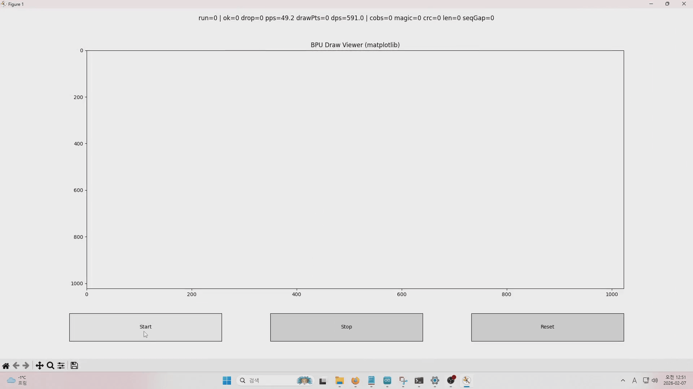

# BPU Stream Engine

High-speed realtime streaming engine demo using ESP32 devices.

This project demonstrates a reliable serial data pipeline:

ESP32-WROOM → ESP32-S3 → PC  
with COBS framing, CRC16 validation, and live visualization.

Designed for stress-testing embedded streaming systems.

---

## Demo

Realtime draw streaming over UART (921600 baud) with live CRC/sequence monitoring.

---

## Project Goal

To build and validate a high-reliability, high-throughput embedded streaming pipeline
for real-time visualization and stress testing.

---

## Features

- COBS framing (0x00 delimited packets)
- CRC16-CCITT integrity check
- Sequence number validation
- High-rate draw stress generator
- Live visualization on PC (Python + matplotlib)
- Throughput and error statistics

---

## System Architecture

ESP32-WROOM (Generator)
        |
     UART @921600
        |
ESP32-S3 (Bridge)
        |
   USB CDC
        |
       PC Viewer

---

## Repository Structure

bpu-stream-engine/
 ├ s3_uart_bridge/
 │   └ s3_uart_bridge.ino
 │
 ├ bpu_r4_safe.ino
 ├ bpu_r4.cpp
 ├ bpu_r4.h
 │
 ├ bpu_decode.py
 ├ bpu_draw_viewer.py
 ├ bpu_mat_viewer.py
 │
 ├ demo.gif
 └ README.md

---

## Firmware

### Main Files

| File | Description |
|------|-------------|
| bpu_r4_safe.ino | Main firmware entry |
| bpu_r4.cpp | Core stream engine |
| bpu_r4.h | Engine definitions |

Runs on ESP32-WROOM.

---

## Build & Flash

### ESP32-WROOM

1. Open bpu_r4_safe.ino
2. Select board: ESP32 Dev Module
3. Select correct COM port
4. Upload firmware

### ESP32-S3 Bridge

Upload s3_uart_bridge/s3_uart_bridge.ino  
Board: ESP32-S3 Dev Module

---

## Wiring

WROOM TX → S3 RX  
WROOM RX → S3 TX (optional)  
GND → GND  

Baudrate: 921600

---

## PC Viewer

### Install

pip install pyserial matplotlib numpy

---

### List Ports

python -m serial.tools.list_ports

---

### Run

python bpu_mat_viewer.py COM11

(Change COM port if needed)

---

## Viewer Output

- Realtime draw points
- PPS / DPS
- CRC errors
- Sequence gaps

Stable example:

crc=0  seqGap=0  drop=0

---

## Packet Format

[MAGIC | TYPE | SEQ | LEN | PAYLOAD | CRC16]

MAGIC = 0xB2  
CRC = CCITT

COBS framed, 0x00 delimited.

---

## Performance

UART: 921600  
1000+ pkt/s  
10k+ pts/s  
Zero CRC errors

---

## Project Status

Streaming: Stable  
Validation: Verified  
Viewer: Working  
Stress: Enabled  

---

## Future Work

- Bidirectional control
- Compression
- Web viewer
- Sync
- FPGA offload

---

## License

MIT License

---

## Author

Himchan Choi  
Embedded Systems Engineer  
High-Speed Data Streaming & Visualization  

GitHub: https://github.com/choihimchan
